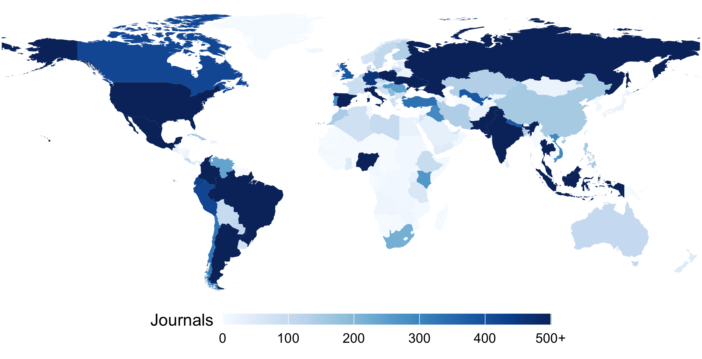

# Invisible Academia



By analyzing 25,671 journals largely absent from common journal counts, as well as Web of Science and Scopus, our studies demonstrate that scholarly communication is more of a global endeavor than is commonly credited. These journals, employing the open-source publishing platform Open Journal Systems (OJS), have published 5.8 million items; they are in 136 countries, with 79.9% in the Global South and 84.2% following the OA diamond model (charging neither reader nor author). A substantial proportion of journals operate in more than one language (48.3%), with research published in 60 languages (led by English, Indonesian, Spanish, and Portuguese). The journals are distributed across the social sciences (45.9%), STEM (40.3%), and the humanities (13.8%). For all their geographic, linguistic, and disciplinary diversity, 1.2% are indexed in the Web of Science and 5.7% in Scopus. On the other hand, 1.0% are found in Cabell's Predatory Reports, and 1.4% show up in Beall's (2021) questionable list. This research seeks to both contribute to and historically situate the expanded scale and diversity of scholarly publishing in the hope that this recognition may assist humankind in taking full advantage of what is increasingly a global research enterprise.



> Khanna, S., Ball, J., Alperin, J. P., & Willinsky, J. (2022). Recalibrating the scope of scholarly publishing: A modest step in a vast decolonization process. *Quantitative Science Studies*, 3(4), 912–930. [https://doi.org/10.1162/qss_a_00228](https://doi.org/10.1162/qss_a_00228)


```bibtex
@article{khanna2022recalibrating,
  title={Recalibrating the scope of scholarly publishing: A modest step in a vast decolonization process},
  author={Khanna, Saurabh and Ball, Jon and Alperin, Juan Pablo and Willinsky, John},
  journal={Quantitative Science Studies},
  volume={3},
  number={4},
  pages={912--930},
  year={2022},
  publisher={MIT Press One Broadway, 12th Floor, Cambridge, Massachusetts 02142, USA}
}
```





