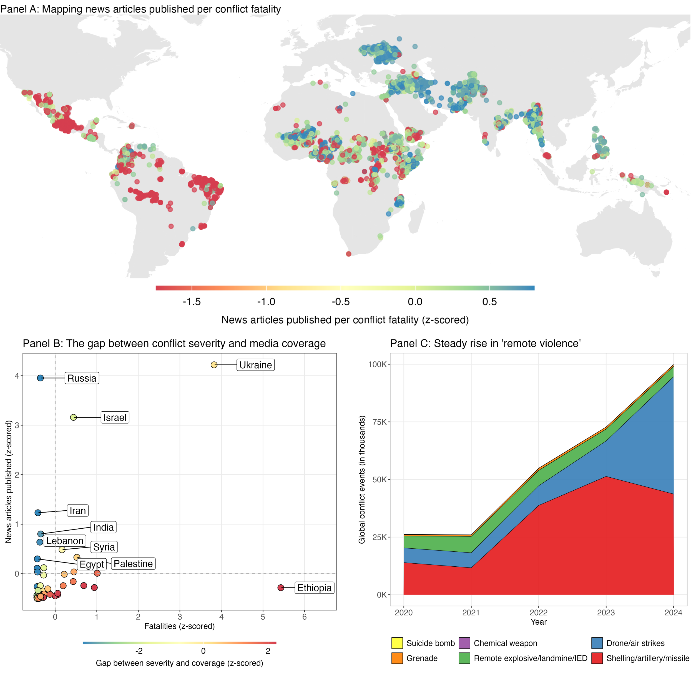

# Invisible Conflicts

This project analyzes under-reported armed conflicts and humanitarian crises worldwide, revealing patterns of media neglect and geopolitical bias in global awareness. By combining conflict event databases with media coverage data, this project quantifies which crises receive disproportionately little attention and why.

Project in progress, reach out to [s.khanna@uva.nl](mailto:s.khanna@uva.nl) for further details.

