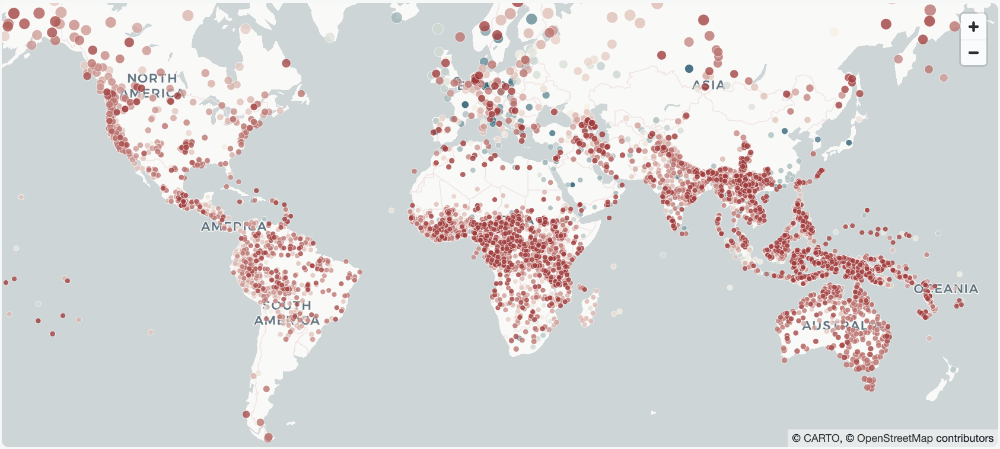

# Invisible Languages

Thousands of living languages are spoken in homes and communities yet remain absent from digital platforms, search engines, and online knowledge spaces - what we call *invisible languages*. This project follows a multi-phase roadmap to responsibly reduce this digital exclusion: from establishing community governance and consent, to encoding and writing tools, platform integration, findability and preservation, and sustained digital usage.


